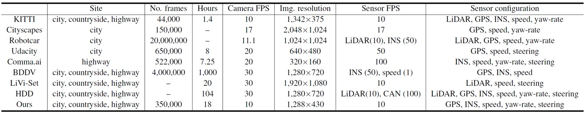
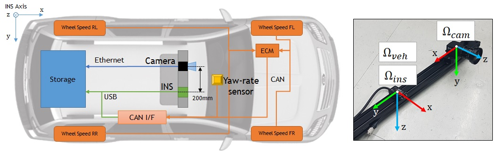

# Driving Visuomotor Dataset (BMVC 2019)

This is a dataset instruction page for 
**"Visuomotor Understanding for Representation Learning of Driving Scenes"**,
published in ***British Machine Vision Conference (BMVC) 2019***.

※ The dataset is in the process of licensing. Please stay tuned!

## Comparison with other driving datasets

## Our vehicle sensor system

