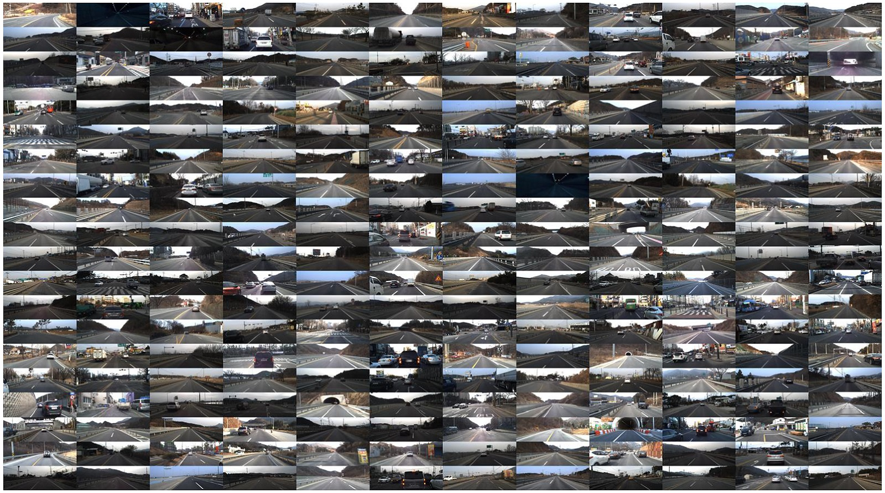

# Driving Visuomotor Dataset (BMVC 2019)

This is a dataset instruction page for 
**"Visuomotor Understanding for Representation Learning of Driving Scenes"**,
published in ***British Machine Vision Conference (BMVC) 2019***.

※ The dataset is in the process of licensing. Please stay tuned!




## Our vehicle sensor system


## Sensor annotation

1. IMU

    ```Shell
    msg_imu->orientation.x
    msg_imu->orientation.y
    msg_imu->orientation.z
    msg_imu->orientation.w
    msg_imu->angular_velocity.x
    msg_imu->angular_velocity.y
    msg_imu->angular_velocity.z
    msg_imu->linear_acceleration.x
    msg_imu->linear_acceleration.y
    msg_imu->linear_acceleration.z
    ```


2. CAN

    ```
    msg_can->rpm
    msg_can->vs
    msg_can->wheel_speed_fl
    msg_can->wheel_speed_fr
    msg_can->wheel_speed_rl
    msg_can->wheel_speed_rr
    msg_can->yawrate
    msg_can->steer
    msg_can->brake
    msg_can->gear
    msg_can->tps
    msg_can->engine_temp
    msg_can->awdmode
    ```


## Comparison with other driving datasets


## Citation
Please cite [our paper](http://bmvc2019.org/wp-content/uploads/papers/0002-paper.pdf) in your publications if it helps your research:
    
    @InProceedings{Lee_2019_BMVC,
      author = {Lee, Seokju and Kim, Junsik and Oh, Tae-Hyun and Jeong, Yongseop and Yoo, Donggeun and Lin, Stephen and Kweon, In So},
      title = {Visuomotor Understanding for Representation Learning of Driving Scenes},
      booktitle = {The British Machine Vision Conference (BMVC)},
      month = {Sep},
      year = {2019}
    }
